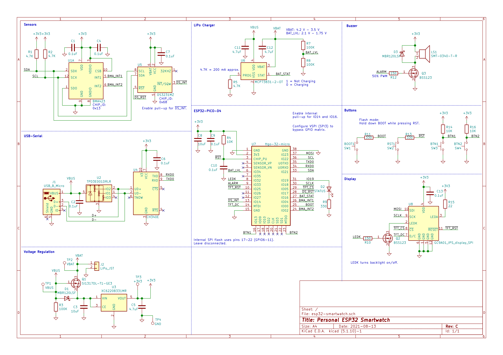
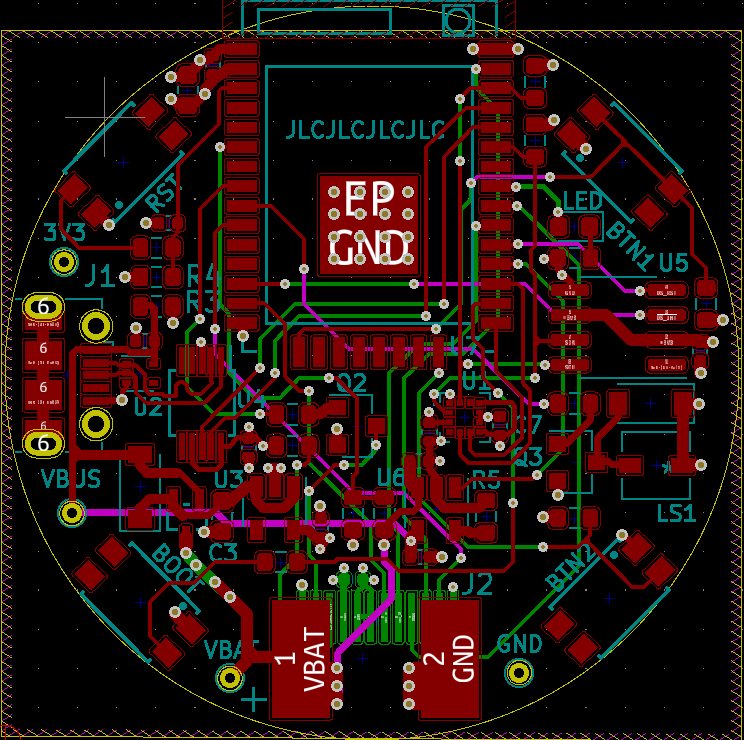

# ESP32 Smartwatch

## Prototype

## Schematic

## PCB

### Functional Overview

* Adjustable time and alarm
* Enable or disable alarm buzzer
* Deep sleep on inactivity
* Wake up on wrist tilt or tap

### To-do
* Configure pedometer
* Pull weather information from the Internet

